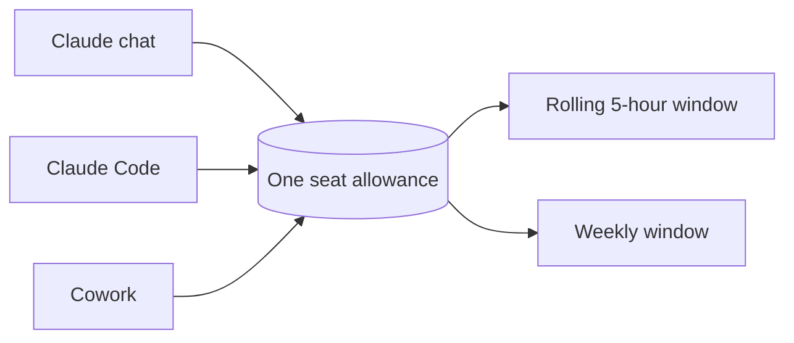

For about two months now, everyone at Thinkport has had a Claude Team seat. My credo since day one: **every unused token is a wasted token.**

My colleagues mostly think I'm joking. I'm not. But the credo needs a footnote, and last Friday gave me a good reason to write it down.

## Why "use it or lose it" is the right instinct

The seat is paid for whether you touch it or not. That's the whole argument, and it's almost too simple to take seriously.

The intention behind the rollout was never subtle: everyone should get their hands dirty with AI, use it to support their own processes, and — ideally — stumble into ideas nobody asked for. An untouched seat isn't a saving. It's a colleague who hasn't started yet.

So the waste I'm actually worried about isn't the tokens. It's the learning that didn't happen. Tokens are just the part you can count.

## The limits force you to plan, whether you like it or not

Claude doesn't make "burn it all" easy, and I had one of the details wrong for weeks. Two windows apply to every seat, and they run at the same time:

| Window  | Behaviour                                |
| ------- | ---------------------------------------- |
| Session | Resets on a **rolling five-hour** window |
| Weekly  | Resets at a fixed time each week         |

I had the session window filed in my head as four hours. It's five. That sounds pedantic until you plan a working day around the wrong number and get throttled at the wrong moment.

The part that surprises people more is that it's **one pool**. The allowance is shared across Claude chat, Claude Code and Cowork, and it's shared across models too — so switching from Opus to Sonnet with `/model` doesn't hand your session back. It only helps when you've hit an Opus-specific limit and want to keep working.

Which means the browser tab you left open all morning is competing with the terminal you actually need. A few habits genuinely stretch the week:

- **`/clear` between unrelated tasks.** The full conversation is re-sent with every message, so a one-line question in a session that's been open since breakfast pays for the whole morning.
- **Match the model to the job.** Sonnet handles most things. Opus is for the genuinely hard reasoning.
- **Use plan mode before a big change.** Agreeing the approach first is far cheaper than paying for the wrong implementation and then paying again to undo it.

None of this is rationing for its own sake. It's the difference between spending your quota on work and spending it on re-reading your own context.

## Then the leaderboard arrived

Last Friday our boss published the first usage figures across the team and singled out the person who'd consumed the most, as encouragement for everyone else to push harder.

The instinct is exactly right. Make it visible, make it social, get people off the fence. Anthropic ships a per-user spend report and an adoption dashboard precisely because the first problem with a rollout like this is silence, not overspend.

But tokens are an **activity** metric wearing a **value** metric's clothing, and that gap matters once people notice they're being measured.

A colleague who solves the right problem in three well-aimed prompts scores worse than one who brute-forces the same thing in three hundred. An idle session with a bloated context quietly bills you as its owner fetches a coffee. And the habits I listed above — clearing, right-sizing the model, planning first — all _lower_ your number whilst making you better at the tool. Reward the meter long enough and you'll get people optimising for the meter.

So I'd read the leaderboard as a **floor, not a race**. Near-zero usage after two months is worth a conversation. Beyond that, the interesting question isn't who spent the most — it's who shipped something they couldn't have shipped in May. Publish the numbers by all means, but publish them next to a story about what somebody actually built. That's the version colleagues can copy.

## The bit people find provocative

Here's where I lose about half the room: I think the tokens your employer gives you are fair game for private projects too.

Work comes first, always. If I need the quota for client work, client work gets it. What's left over at the end of the week is not going to improve anyone's balance sheet by expiring quietly on a Sunday night.

Two reasons this is good for the employer rather than merely good for me.

**You learn a tool properly on projects you actually care about.** Nobody explores the awkward edges of an agent workflow on a client deliverable with a deadline attached. They do it on the silly side project where breaking things costs nothing. The fluency comes back to work on Monday regardless of where it was earned.

**Generous sanctioned access is the cheapest cure for shadow AI.** If people have enough capacity on a company seat, they don't quietly paste work into a personal account that no admin can see, no policy covers, and no audit will ever find. Tightening the seat doesn't reduce how much AI your staff use. It just relocates it somewhere you have no visibility into. Given the choice between usage I can see on a managed tenant and usage I can't see at all, the managed tenant wins every time.

## Where the line actually sits

I'd rather be precise about this than wave it away, because "use the leftovers" stops being obviously fine at a few specific points — and all of them are about data, not tokens.

**Data direction matters more than token direction.** Client data stays in the company tenant. Just as importantly, my own clients' data doesn't go into my employer's tenant either. That one is my obligation, not theirs, and it's the constraint people forget because it points the other way.

**"Work first" is an ordering rule, not a slogan.** If a colleague gets throttled on a Thursday because I ran a private batch job on Wednesday, I got it wrong. Shared pools make that a real possibility, not a hypothetical.

**My own company is the genuinely grey part.** I run [kieks.me](https://kieks.me) as a GbR. Personal learning on an employer's seat is easy to defend. Commercial work for my own business on an employer's seat is a different conversation — and one worth having out loud rather than assuming the answer. I'd want that written down somewhere, not left to everyone's private interpretation.

The rough test I use: anything I wouldn't happily say in the team channel is already answered.

Had I employees at kieks.me, I'd handle it exactly the way Thinkport does. The generous version of this policy costs the company nothing extra — the seat is paid either way — and it buys a workforce that's genuinely fluent rather than one that's completed the training.

I wrote recently about [being addicted to AI tokens](/posts/i-am-addicted-to-ai-tokens) and how "don't let it expire" is a terrible way to decide what deserves your attention. Both things are true at once. Chasing the meter is a bad habit. Leaving a paid seat untouched for two months is a worse one.

So: is your employer's AI budget a resource to be spent or a cost to be minimised? And if it's the first — does everyone on your team actually know that?
