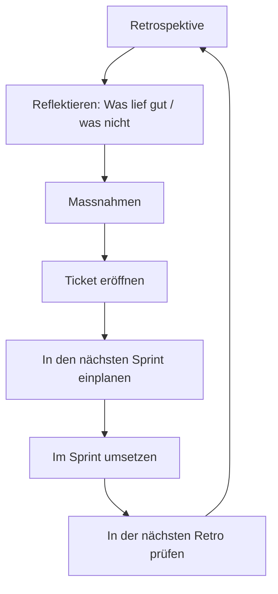

Ich mag Retrospektiven. _(Ja … Clickbait, aber bleib kurz dran.)_ Wirklich. Die Idee – anhalten, reflektieren, anpassen – gehört zu den wenigen Scrum-Ritualen, die ich behalten würde, selbst wenn ich alles andere abschaffen würde. Und trotzdem spüre ich jedes Mal, wenn die Kalendererinnerung auftaucht, einen kleinen Widerstand.

Es hat eine Weile gedauert, bis ich verstanden habe, warum.

## Wir sind darauf trainiert, nach Schäden zu suchen

Die meisten Retrospektiven, an denen ich teilgenommen habe, folgen einer Variante des klassischen Drei-Spalten-Formats: _Was lief gut_, _Was lief schlecht_, _Was wollen wir verbessern_. Theoretisch ist das ausgewogen. Praktisch fliesst fast die gesamte Energie in die zweite Spalte.

Wir verbringen zwanzig Minuten damit, alles zu katalogisieren, was wehgetan hat. Die Deployment-Pipeline, unklare Anforderungen, das Meeting, das eine E-Mail hätte sein sollen. Spalte eins bekommt fünf Minuten höfliche Anerkennung, bevor alle versuchen, aus Spalte zwei eine Liste von Massnahmen zu machen.

Daran ist etwas kulturell fast Vertrautes: die Tendenz, Probleme als die einzigen Dinge zu behandeln, die ernst genommen werden müssen. Gute Dinge werden erwartet. Schlechte Dinge müssen gelöst werden.

## Die Massnahmen, die niemand überprüft

Der andere Teil ist: Wir schreiben die Punkte auf, weisen sie jemandem zu und dann … was?

Es liegt nicht daran, dass dem Team die Themen egal sind. Die Retro produziert Ergebnisse, für die es keinen nächsten Ort gibt. Die Themen verdienen echte Nachverfolgung: Für jede Massnahme sollte ein Ticket eröffnet und sie in den nächsten Sprint eingeplant werden. Als Tech Lead spürst du die Lücke, wenn du mit einer Liste von Zusagen gehst, die es nie auf das Board schafft.

Dieser geschlossene Kreislauf macht aus einer Beschwerderunde eine Gewohnheit.

## Wie eine belebende Retro tatsächlich aussieht

Ich habe Retrospektiven erlebt, die sich wirklich nützlich angefühlt haben. Sie hatten einige Gemeinsamkeiten: Jemand hat tatsächlich _moderiert_, statt nur den Ablauf zu verwalten. Die Spalte „Was lief gut“ bekam mehr Zeit als die Problemspalte. Und mindestens eine Massnahme aus dem letzten Mal wurde sichtbar abgeschlossen oder weitergeführt, bevor die neue Liste wuchs.

Das Team ging mit dem Gefühl von Bewegung aus dem Raum. Nicht mit dem Gefühl, einen Beschwerdebericht abgegeben zu haben.

## Das Format ist in Ordnung. Die Kultur darum herum nicht

Ich glaube nicht, dass das Format der Retrospektive neu erfunden werden muss. Ich glaube, wir müssen aufhören, sie als Prüfung zu behandeln, und anfangen, sie als Ritual zur Entwicklung guter Gewohnheiten zu verstehen.

Das bedeutet, Erfolge so deutlich zu feiern, dass das Team sie tatsächlich wahrnimmt. Es bedeutet, zuerst frühere Zusagen abzuschliessen, bevor neue eröffnet werden. Und es bedeutet, dass diejenigen, die im Raum Einfluss haben – Scrum Master, Tech Lead oder Engineering Manager –, diesen Anspruch konsequent vertreten und nicht nur dann, wenn es gerade passt.

Die Retro ist nicht das Problem. Das Problem ist, wofür wir sie stillschweigend halten.

Wie fühlt sich die Retro in deinem Team gerade wirklich an – und wäre das die Version, die du von Grund auf entwerfen würdest?
