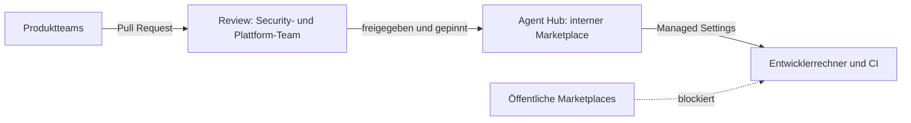

Irgendwo in deinem Unternehmen gibt es denselben Skill fünfmal. Team A hat einen Skill zum Review von Terraform-Plänen geschrieben. Team B hat ihn kopiert und eine Tagging-Regel ergänzt. Team C hat etwas Ähnliches im Internet gefunden, weil es viele Sterne hatte.

Niemand hat etwas falsch gemacht. Es gab schlicht keinen Ort, an dem ein Skill leben, besser werden und Vertrauen aufbauen kann. Ich habe dieses Muster oft genug gesehen, um nicht mehr von Zufall zu sprechen.

## "Skill-Repository" war von Anfang an der falsche Name

Die Idee klingt einfach: ein Repository, alle Teams tragen bei, niemand wiederholt sich. Völlig richtig. Sobald aber auch MCP-Server und Agents verteilt werden sollen, passt der Name nicht mehr. Ein MCP-Server ist laufende Software mit Netzwerkzugriff und Zugangsdaten. Ein Agent bündelt Anweisungen, Werkzeuge und Berechtigungen. Ein Skill ist überwiegend Markdown mit gelegentlichem Skript. Drei sehr unterschiedliche Risikoprofile in einem Ordner namens "skills".

Die Begrifflichkeit ist noch nicht gesetzt. Ich höre immer häufiger **Agent Hub**, und der Begriff gefällt mir am besten, weil er die Aufgabe beschreibt statt das Dateiformat. Ein Herstellerprodukt mit genau diesem Namen habe ich nicht gefunden. Gefunden habe ich den Nachbarbegriff **Registry**: Die Agent Registry von Google Cloud ist seit Juni 2026 allgemein verfügbar und deckt Agents und MCP-Server ab, im Juli kam Skill-Governance als Preview dazu. Der Markt nähert sich also dem Problem an, nur noch nicht dem Wort.

## Ein Hub, ein Review-Gate

Meine bevorzugte Form ist mit Absicht unspektakulär: Ein dediziertes Team betreibt den Hub, alle anderen Teams tragen per Pull Request bei, und nichts erreicht einen Entwicklerrechner ohne Review.



Der Trade-off ist real. Ein zentrales Team ist ein Flaschenhals, und ein träger Review-Prozess treibt Leute direkt zurück ins offene Internet. Das Review braucht deshalb ein Service-Level, nicht nur ein Tor. Dafür bekommst du eine Stelle, an der ein fehlerhafter Skill repariert wird, einen Audit-Trail und eine Antwort auf die Frage "was ist wo installiert?".

Bei Claude Code ist die Durchsetzung über Managed Settings bereits möglich. Verkürzt aus der Anthropic-Dokumentation:

```json
{
  "strictKnownMarketplaces": [
    { "source": "github", "repo": "your-org/agent-hub" }
  ],
  "extraKnownMarketplaces": {
    "agent-hub": {
      "source": { "source": "github", "repo": "your-org/agent-hub" }
    }
  },
  "enabledPlugins": { "terraform-review@agent-hub": true },
  "strictPluginOnlyCustomization": true,
  "disableSideloadFlags": true
}
```

Die Allowlist begrenzt, woher Plugins kommen dürfen. `strictPluginOnlyCustomization` blockiert Skills, Agents, Hooks und MCP-Server, die auf anderem Weg ins System gelangen, und `disableSideloadFlags` schließt die Hintertür über die Kommandozeile. Kombiniere das mit einer Allowlist für MCP-Server, denn das Sideload-Flag allein deckt diese nicht ab.

## Warum das Internet keine Paketquelle für dich ist

Bei KRITIS-Unternehmen wird die Diskussion hier kurz. Ein Skill ist Software. Er kann einen Agenten anweisen, Befehle auszuführen, und er kann Skripte mitbringen. Jede Installation sollte als ungeprüfte Codeausführung gelten, so formuliert es die Cloud Security Alliance.

Das ist nicht theoretisch. Koi Security hat Anfang 2026 alle 2.857 Skills auf ClawHub geprüft, dem Marketplace des OpenClaw-Agents, und 341 bösartige gefunden. Viele nutzten einen gefälschten Abschnitt "Prerequisites", um Nutzer zur Installation eines Infostealers zu bewegen. Unit 42 beschrieb später bösartige Skills, die das plattformeigene Scanning umgingen. Scanner helfen, aber sie sind ein Filter und kein Urteil.

Das Review muss deshalb drei Dinge abdecken: was der Skill anweist, was er ausführt und womit er sich verbindet. Und es muss für MCP-Server und Agents genauso streng gelten wie für Skills.

## Die Hersteller sind sich bei Plugins einig, sonst bei wenig

Claude Code und Codex nutzen beide Plugins und Marketplaces als Verteileinheit. Darüber hinaus unterscheiden sie sich:

- **Claude Code**: Plugins können Skills, Agents, Hooks und MCP-Server bündeln. Die Governance ist ausführlich dokumentiert, inklusive Allowlists, Pflicht-Plugins und OpenTelemetry-Events für Installationen.
- **Codex**: Laut OpenAI-Dokumentation bündeln Plugins Skills, MCP-Server, Browser-Erweiterungen und Hooks. Agents werden nicht als Komponente genannt. Admins können einen GitHub-Marketplace importieren und synchronisieren, Hook-Skripte müssen per MDM verteilt werden. Details zu Policy-Dateien und privaten Marketplaces konnte ich aus der OpenAI-Dokumentation nicht belegen, deshalb beschreibe ich sie hier nicht.
- **Google Cloud**: eine Registry für Agents, MCP-Server und, als Preview, Skills, mit Terraform-Unterstützung.

Einen Paketmanager, der sich durchgesetzt hat, gibt es ebenfalls nicht. Das Skill-Format ist mit agentskills.io offen standardisiert, die Installation aber zersplittert. `npx skills` mit Lock-Datei, kuratierte Verzeichnisse und Community-Werkzeuge existieren nebeneinander, und die Berichte über ihre Verbreitung widersprechen sich. Meine Wette: Die Runtimes von Anthropic und OpenAI werden diese Schicht irgendwann aufnehmen. Bis dahin ist dein interner Hub dein Paketmanager und ein Git-Tag dein Version-Pin.

## Die Beratung rückt eine Ebene nach oben

Ich erwarte, dass ein großer Teil dessen, was wir heute IT-Beratung nennen, genau darauf hinausläuft: Unternehmen beim Aufbau ihrer AI-Infrastruktur zu beraten und beim Betrieb zu begleiten. Hub-Design, Review-Prozesse, Identitäten und Secrets für MCP-Server, Monitoring. IT- und AI-Security sind dann kein Randthema mehr, sondern das Hauptthema. Das ist meine Einschätzung und kein Fakt, und die nächsten zwei Jahre zeigen, wie viel davon trägt.

Wie nennt ihr diese Schicht in eurem Unternehmen: Skill-Repository, Agent Hub, Registry oder etwas ganz anderes?
