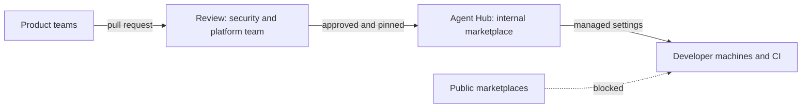

Somewhere in your company, the same skill exists five times. Team A wrote one for reviewing Terraform plans. Team B copied it and added a rule about tagging. Team C found something similar on the internet, because it had a lot of stars.

Nobody did anything wrong. There was simply no place where a skill could live, be improved and be trusted. I have seen this pattern often enough to stop calling it a coincidence.

## "Skill repository" was the wrong name from the start

The idea sounds simple: one repository, every team contributes, nobody repeats themselves. Fair enough. But the moment you also want to distribute MCP servers and agents, the name stops fitting. An MCP server is running software with network access and credentials. An agent bundles instructions, tools and permissions. A skill is mostly Markdown with the occasional script. Three very different risk profiles in one folder called "skills".

The vocabulary is still unsettled. I keep hearing **Agent Hub**, and I think it fits best, because it describes the job rather than the file format. I did not find a vendor product with that exact name. What I did find is the neighbouring term **registry**: Google Cloud's Agent Registry has been generally available since June 2026 and covers agents and MCP servers, with skill governance added in preview in July. So the market is converging on the problem, not yet on the word.

## One hub, one review gate

My preferred shape is boring on purpose: a dedicated team owns the hub, every other team contributes through pull requests, and nothing reaches a developer machine without passing a review.



The trade-off is real. A central team is a bottleneck, and a slow review process drives people straight back to the public internet. Review needs a service level, not just a gate. In return you get one place to fix a flawed skill, one audit trail and one answer to "what is installed where?".

On the Claude Code side, the enforcement is already available through managed settings. This is condensed from Anthropic's documentation:

```json
{
  "strictKnownMarketplaces": [
    { "source": "github", "repo": "your-org/agent-hub" }
  ],
  "extraKnownMarketplaces": {
    "agent-hub": {
      "source": { "source": "github", "repo": "your-org/agent-hub" }
    }
  },
  "enabledPlugins": { "terraform-review@agent-hub": true },
  "strictPluginOnlyCustomization": true,
  "disableSideloadFlags": true
}
```

The allowlist limits where plugins may come from, `strictPluginOnlyCustomization` blocks skills, agents, hooks and MCP servers that arrive any other way, and `disableSideloadFlags` closes the command-line side door. Pair it with an allowlist for MCP servers, because the sideload flag alone does not cover those.

## Why the internet is not your package registry

For KRITIS companies, this is where the conversation gets short. A skill is software. It can instruct an agent to run commands, and it can ship scripts. Treat every installation as an unreviewed code execution, as the Cloud Security Alliance puts it.

This is not theoretical. Koi Security audited the 2,857 skills on ClawHub, the marketplace of the OpenClaw agent, in early 2026 and found 341 malicious ones. Many used a fake "Prerequisites" section to talk users into installing an infostealer. Unit 42 later described malicious skills that evaded the platform's own scanning. Scanners help, but they are a filter, not a verdict.

So the review has to cover three things: what the skill instructs, what it executes, and what it connects to. And it has to apply to MCP servers and agents just as strictly as to skills.

## Vendors agree on plugins, and on little else

Both Claude Code and Codex use plugins and marketplaces as the distribution unit. Beyond that, they differ:

- **Claude Code**: plugins can bundle skills, agents, hooks and MCP servers. Governance is documented in detail, including allowlists, forced plugins and OpenTelemetry events for installs.
- **Codex**: according to OpenAI's documentation, plugins bundle skills, MCP servers, browser extensions and hooks. Agents are not listed as a component. Admins can import and sync a GitHub marketplace, and hook scripts have to be deployed through MDM. I could not verify the details of policy files or private marketplaces from OpenAI's own documentation, so I will not describe them here.
- **Google Cloud**: a registry for agents, MCP servers and, in preview, skills, with Terraform support.

There is also no package manager that has won. The skill format itself is an open standard at agentskills.io, but installation is fragmented. `npx skills` with a lock file, curated directories and community tools all exist side by side, and reports on their scale conflict. My bet: the runtimes from Anthropic and OpenAI will absorb this layer eventually. Until then, your internal hub is your package manager, and a Git tag is your version pin.

## The consulting job moves up the stack

I expect a large part of what we call IT consulting today to become exactly this: helping companies set up their AI infrastructure and keep it maintained. Hub design, review processes, identity and secrets for MCP servers, monitoring. IT security and AI security stop being a side topic and become the main one. That is my opinion, not a fact, and the next two years will show how much of it holds.

What would you call this layer in your company: skill repository, agent hub, registry, or something else entirely?
