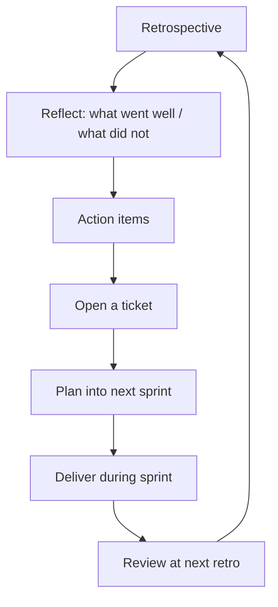

I like retrospectives. _(Yea … click bait but hold on!)_ I genuinely do. The idea — stop, reflect, adjust — is one of the few Scrum rituals I'd keep even if I abandoned everything else. And yet, when the calendar reminder pops up, I notice a small dread settling in.

It took me a while to figure out why.

## We're trained to look for damage

Most retros I've attended follow some version of the classic three-column format: _What went well_, _What didn't_, _What we'll improve_. In theory, that's balanced. In practice, the energy flows almost entirely to column two.

We spend twenty minutes cataloguing everything that hurt. The deployment pipeline, the unclear requirements, the meeting that should have been an email. Column one gets five minutes of polite acknowledgement before everyone rushes to turn column two into a list of action items.

There's something almost culturally familiar about this — a tendency to treat problems as the only things worth taking seriously. Good things are expected. Bad things need solving.

## The action items that nobody checks

Here's the other part: we write them down, assign them, and then … what?

It's not that the team doesn't care. It's that the retro produces outputs with nowhere to go. The topics deserve real follow-through: open a ticket for each action item and plan it into the next sprint. As a tech lead, you can feel the gap when you leave with a list of commitments that never makes it onto the board.

That closed loop is what turns a retro from a complaint session into a habit.

## What an energising one actually looks like

I've been in retros that felt genuinely useful. They shared a few things in common: someone actually _facilitated_ rather than just moderated, the "what went well" column got more time than the problems did, and at least one action item from last time was visibly closed or carried forward before the new list started growing.

The team left feeling like it had momentum. Not like it had filed a complaint report.

## The format is fine. The culture around it isn't

I don't think the retrospective format needs redesigning. I think we need to stop treating it as an audit and start treating it as a habit-forming ritual.

That means celebrating what worked, loudly enough that the team actually registers it. It means closing loops on previous commitments before opening new ones. And it means whoever holds influence in the room — Scrum Master, tech lead, engineering manager — holding that standard consistently rather than just when they feel like it.

The retro isn't the problem. It's what we silently decided it's for.

What does your team's retro actually feel like right now — and is that the version you'd design from scratch?
